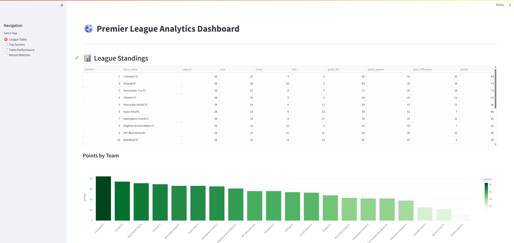
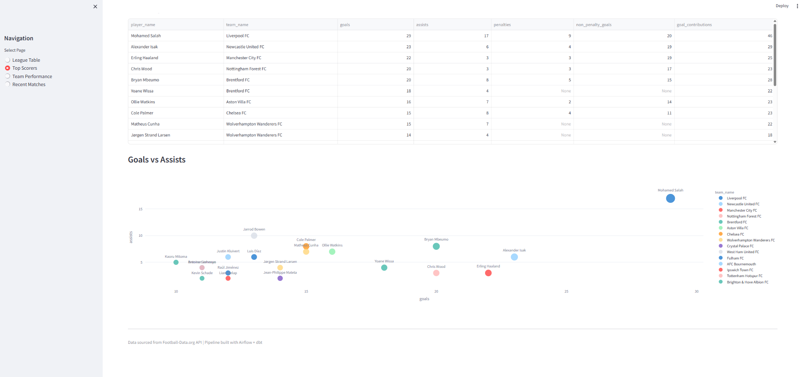

# ⚽ Premier League Data Pipeline

An end-to-end data engineering project that ingests Premier League soccer data, transforms it using dbt, and visualizes it in a Streamlit dashboard.

## Architecture

```
Football-Data.org API → Airflow DAGs → PostgreSQL (Raw) → dbt (Transform) → Streamlit Dashboard
```


## Tech Stack

| Layer | Technology |
|-------|------------|
| Orchestration | Apache Airflow 2.7 |
| Database | PostgreSQL 15 |
| Transformation | dbt-core 1.7 |
| Visualization | Streamlit |
| Containerization | Docker Compose |

## Data Sources

- **Matches** — Full season results with scores
- **Standings** — Current league table
- **Top Scorers** — Goals, assists, penalties
- **Teams** — Club information and venues

## Project Structure

```
soccer-pipeline/
├── dags/
│   ├── ingest/
│   │   ├── matches.py
│   │   ├── standings.py
│   │   ├── scorers.py
│   │   └── teams.py
│   ├── transform/
│   │   └── run_dbt.py
│   ├── utils/
│   │   ├── api_client.py
│   │   └── db_utils.py
│   └── master_pipeline.py
├── dbt/
│   ├── models/
│   │   ├── staging/
│   │   │   ├── stg_matches.sql
│   │   │   ├── stg_standings.sql
│   │   │   ├── stg_scorers.sql
│   │   │   ├── stg_teams.sql
│   │   │   └── schema.yml
│   │   └── marts/
│   │       ├── dim_teams.sql
│   │       ├── fct_form_table.sql
│   │       ├── fct_head_to_head.sql
│   │       ├── fct_monthly_goals.sql
│   │       ├── fct_player_performance.sql
│   │       ├── fct_team_performance.sql
│   │       └── schema.yml
│   ├── dbt_project.yml
│   └── profiles.yml
├── streamlit/
│   ├── app.py
│   ├── Dockerfile
│   └── requirements.txt
├── docker-compose.yml
├── Dockerfile.airflow
├── .env
└── README.md
```

## Data Model

### Raw Layer
- `raw_matches` — API response data
- `raw_standings` — League table snapshots
- `raw_scorers` — Top scorer statistics
- `raw_teams` — Team metadata

### Staging Layer
- `stg_matches` — Cleaned matches with derived fields (result, total_goals)
- `stg_standings` — Standings with points_per_game, goals_per_game
- `stg_scorers` — Scorers with non_penalty_goals, goal_contributions
- `stg_teams` — Teams with years_since_founding

### Marts Layer
- `dim_teams` — Enriched team dimension with current standings and league tier classification
- `fct_team_performance` — Aggregated home/away performance metrics
- `fct_player_performance` — Player statistics with rankings across goals, assists, and contributions
- `fct_form_table` — Last 5 matches form for each team with W/D/L string
- `fct_head_to_head` — Historical matchup statistics between team pairs
- `fct_monthly_goals` — Monthly goal-scoring trends and statistics

## Pipeline Orchestration

The `master_pl_pipeline` DAG orchestrates the entire workflow:

```
┌─────────────────┐
│ ingest_matches  │───┐
├─────────────────┤   │
│ ingest_standings│───┼───► run_dbt_transforms
├─────────────────┤   │
│ ingest_scorers  │───┤
├─────────────────┤   │
│ ingest_teams    │───┘
└─────────────────┘
```

Ingestion tasks run in parallel, then dbt transformations run after all ingestion completes.

## Dashboard

The Streamlit dashboard provides 8 interactive pages:

| Page | Description |
|------|-------------|
| **League Table** | Current standings with points visualization |
| **Form Table** | Last 5 matches performance with W/D/L form strings |
| **Top Scorers** | Player rankings with goals vs assists breakdown |
| **Team Performance** | Home/away metrics and points per game |
| **Head to Head** | Interactive team comparison with historical matchups |
| **Monthly Trends** | Goal-scoring patterns over time |
| **Teams Directory** | Club information filterable by league tier |
| **Recent Matches** | Latest results with goals distribution |

## Data Quality

dbt tests validate data integrity across all models:

- **Unique** — No duplicate records
- **Not Null** — Required fields are populated
- **Accepted Values** — Fields contain expected values only

Run tests manually:
```bash
docker exec -it soccer-pipeline-airflow-scheduler-1 bash -c "cd /opt/airflow/dbt && dbt test --profiles-dir ."
```

## Setup Instructions

### Prerequisites
- Docker Desktop
- Git
- Free API key from [football-data.org](https://www.football-data.org/)

### Installation

1. Clone the repository
   ```bash
   git clone https://github.com/CarterPettid/soccer-pipeline.git
   cd soccer-pipeline
   ```

2. Create `.env` file
   ```
   FOOTBALL_DATA_API_KEY=your-api-key-here
   ```

3. Start the containers
   ```bash
   docker-compose build
   docker-compose up
   ```

4. Access the services
   - Airflow: http://localhost:8080 (admin/admin)
   - Dashboard: http://localhost:8501

### Running the Pipeline

**Option 1: Master DAG (Recommended)**

Trigger `master_pl_pipeline` — this runs all ingestion and transformation in the correct order.

**Option 2: Individual DAGs**

Trigger DAGs in this order:
1. `ingest_pl_matches`
2. `ingest_pl_standings`
3. `ingest_pl_scorers`
4. `ingest_pl_teams`
5. `run_dbt_transforms`

View results in the Streamlit dashboard at http://localhost:8501

## Features

- **Master orchestration** — Single DAG runs the entire pipeline
- **Parallel ingestion** — Data sources load concurrently
- **Idempotent ingestion** — Upserts prevent duplicate data
- **Incremental updates** — Daily scheduled refreshes
- **Data quality tests** — dbt tests validate transformations
- **Rich analytics** — 6 mart models for comprehensive insights
- **Interactive dashboard** — 8 pages with filters and visualizations
- **Containerized** — Fully reproducible with Docker

## Dashboard Screenshots

### League Table


### Top Scorers


## Author

**Carter Pettid**
- LinkedIn: [carter-pettid](https://www.linkedin.com/in/carter-pettid-49998223a/)
- GitHub: [CarterPettid](https://github.com/CarterPettid)

## License

MIT License
